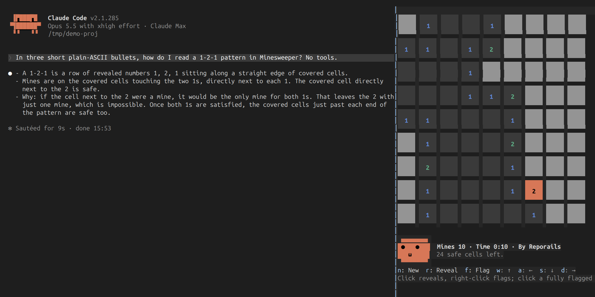

# arcade

Classic desktop games as Claude Code mods, played in a pane while Claude works.



```text
               1  ▆▆ ▆▆ ▆▆
               2  ⚑  ▆▆ ▆▆
               2  ▆▆ ▆▆ ▆▆
               1  1  ▆▆ ▆▆
1  1  1           1  ▆▆ ⚑
▆▆ ▆▆ 2  2  1  1  1  ▆▆ ▆▆
▆▆ ▆▆ ▆▆ ▆▆ ▆▆ ▆▆ ▆▆ ▆▆ ▆▆
▆▆ ▆▆ ▆▆ ▆▆ ▆▆ ▆▆ ▆▆ ▆▆ ▆▆
▆▆ ▆▆ ▆▆ ▆▆ ▆▆ ▆▆ ▆▆ ▆▆ ▆▆

 ▄▄▄▄▄▄▄
  ●   ●    Mines 8 · Time 0:17 · Best 0:42 · By Reporails
    ω      34 safe cells left.
 ▀▀▀▀▀▀▀
```

| Game | What it is |
|---|---|
| [`minefield`](minefield/) | Minesweeper. Click or use the keys to clear the board, with a best time and a face that watches the cursor and glances over at the transcript now and then. Run `/mines`. |

Each game is its own plugin, so you install only the ones you want.

## Install

In a Claude Code session:

```text
/plugin marketplace add reporails/arcade
/plugin install minefield@reporails-arcade
```

Or from your shell, then `/reload-plugins` in any session already open:

```bash
claude plugin marketplace add reporails/arcade
claude plugin install minefield@reporails-arcade
```

Then run the game's command, such as `/mines`.

## Requirements

- Claude Code 2.1.287 or later, where mods are on by default. Each game's README says what to check if one does not start.
- A terminal, or the Claude Code desktop app. VS Code and `claude -p` have nothing to draw a board on; the game says so.
- For the side pane and the mouse, the fullscreen layout: start Claude Code with `CLAUDE_CODE_NO_FLICKER=1`. Without it the pane sits above the prompt and the games are played with the keys alone.

## What a game can see

These mods draw a pane and keep a best time in their own store. They hook no prompt, tool or attachment, so they read and change nothing the model sees, and they make no network calls. Run `claude plugin validate <game>` to list exactly what a game hooks and calls, before any of its code runs.

What the model does read is your `CLAUDE.md` and the rest of your instructions. To see which of them Claude actually follows: [reporails.com](https://reporails.com/?utm_source=arcade&utm_medium=readme).

## Develop

The games are strict TypeScript. Each game folder is a complete plugin:

```bash
claude --plugin-dir ./minefield              # play it from the checkout
claude -p "/plugin-types" < /dev/null        # write the typings for your Claude Code build into .claude/types/
npx -p typescript@5.9.3 tsc -p .             # typecheck every game and its tests
claude plugin validate --strict ./minefield  # what it hooks and calls, and anything the engine would refuse
claude plugin test ./minefield               # its tests
```

`/plugin-types` runs without a login on 2.1.285, behind `CLAUDE_CODE_ENABLE_FUNCTION_HOOKS=1`; from 2.1.287 `claude -p` asks for one. So CI (`.github/workflows/check.yml`) runs on every push to `main` and every pull request, in two jobs: the typecheck, validation and tests on 2.1.285, and the validation and tests again on 2.1.288, where mods are on by default. The typings are generated, never committed: Claude Code's own license does not allow redistributing them.

A new game is a new folder plus one entry in `.claude-plugin/marketplace.json`.

## License

MIT. Made by [Reporails](https://reporails.com/?utm_source=arcade&utm_medium=readme), diagnostics for the instructions that steer Claude Code.
