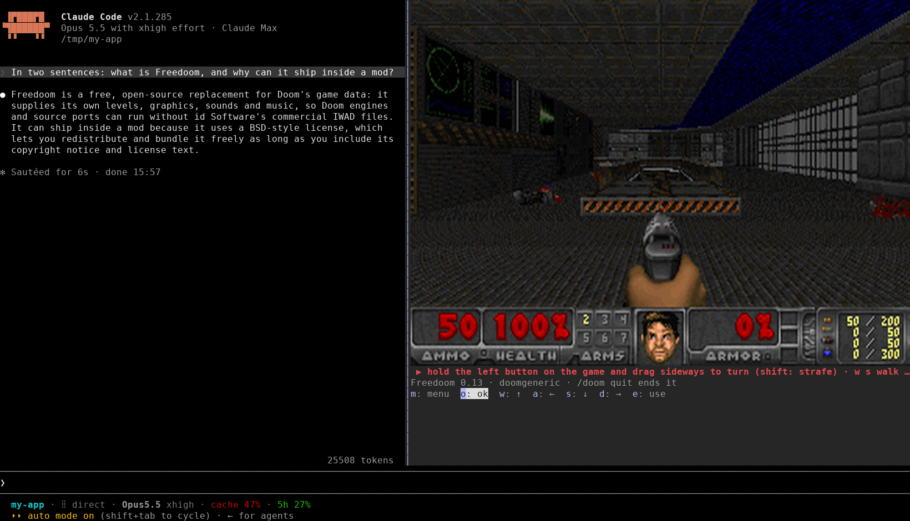

# Doom

Doom in a Claude Code pane. A mod, shipped as a plugin: `/doom` opens a pane and plays Freedoom on the doomgeneric engine while Claude works. In kitty or Ghostty the screen is a real picture at Doom's own 320×200; in any other terminal it is drawn in quadrant block characters, four pixels a cell. It reads nothing the model sees and adds nothing to it. Unlike the other arcade games it does hook the prompt box, and only while you play: game keys that land there go to Doom instead (type `/` to have it back). It runs the engine as a child process and talks to it on this machine only, over a Unix socket or 127.0.0.1.



It carries a prebuilt engine for Linux, macOS and Windows, each on x86_64 and arm64, so no compiler is needed. Only the Linux x86_64 engine has been run so far (see What has been verified).

## Try it

In a Claude Code session:

```text
/plugin marketplace add reporails/arcade
/plugin install doom@reporails-arcade
```

Then start Claude Code in the fullscreen layout and run `/doom`:

```bash
CLAUDE_CODE_NO_FLICKER=1 claude
```

On 2.1.285 or 2.1.286, where mods are early access, add `CLAUDE_CODE_ENABLE_FUNCTION_HOOKS=1`; from 2.1.287 mods load by default. It has been played on 2.1.285 only. From a checkout: `claude --plugin-dir ./doom`.

| Platform | Engine | Picture |
|---|---|---|
| Linux x86_64 / arm64 | `engine/bin/linux-*/doom-claude`, static (musl): any distribution | kitty or Ghostty: the picture; elsewhere blocks |
| macOS Apple silicon / Intel | `engine/bin/macos-*/doom-claude` | kitty or Ghostty: the picture; Terminal.app and iTerm2: blocks |
| Windows x86_64 / arm64 | `engine/bin/windows-*/doom-claude.exe` | blocks (no Windows terminal speaks kitty's picture protocol that the mod detects) |
| Anything else with a C compiler | built on first `/doom` with `make` | as above |

Under WSL, Claude Code is a Linux program and uses the Linux engine.

Run it in kitty or Ghostty for the full picture; the mod finds them by `TERM` / `TERM_PROGRAM`, and falls back to blocks if Claude Code refuses the picture anyway (as it does inside tmux). In any other terminal the screen's size follows the terminal's height: the dock is as tall as the space above the prompt, the screen is 3/8 as many rows as columns (Doom's 4:3), and the pane narrows to the screen's width so the transcript keeps the rest. On a 126×38 terminal that is about 72×27 to 85×32 cells, 144×54 to 170×64 pixels. More rows (a smaller font, or a taller window) give a sharper picture.

`CLAUDE_CODE_NO_FLICKER=1` turns on the fullscreen layout: the pane docks on the right and takes clicks. Without it the pane sits above the prompt and Doom is played with the button keys alone.

## Commands

| Input | What it does |
|---|---|
| `/doom` | Opens the pane and starts Doom. If Doom is running, brings the pane back. |
| `/doom quit` | Ends Doom and closes the pane. |
| `Esc` | Gives the keyboard back to Claude Code's prompt (Claude Code keeps Escape for that; no mod can take it). Game keys you go on pressing still reach Doom: while you play, the mod takes them out of the prompt and hands them to the game. |
| Ctrl+X then X | Closes the pane, which ends Doom. |

`/doom` is an immediate command, so it works while Claude is mid-turn.

## Playing

The mouse turns and the keys walk: a terminal tells when a mouse button goes down and when it comes up, which it never does for a key, so turning, which needs to stop exactly, is the mouse's job.

| Mouse, on the game | Doom |
|---|---|
| Hold the left button and drag left or right | Turn, exactly as fast as `a` and `d` (half speed for the first sixth of a second, as Doom turns a held key), however far you drag; an up or down drag does nothing |
| …with shift held | Strafe instead of turn |
| Let go | Stop turning, at once |
| Hold the right button | Fire, for as long as it is held |

The drag is measured from where the button went down, and keeps working past the edge of the game once the button is down. The red strip under the game takes the same drags and says what the stick is doing ("◉ turn right"). Walk with `w` and `s` while you drag: the keys and the mouse work at once. A click on the game or the strip also gives Doom the keyboard:

| Key | Doom |
|---|---|
| Space | Fire |
| `e` | Use (doors, switches) |
| `1` to `7` | Weapons |
| `m` or backspace | Menu |
| Return | Pick in a menu; yes to Doom's questions (quit, new game, nightmare) |
| Arrows, `w` `a` `s` `d` | Move and turn, held the way a terminal allows (below) |
| `,` `.` | Strafe |
| Tab | Map |
| `p` | Pause |
| `y` `n` | Yes (sends Return), no |
| `Esc` | Hands the keyboard back to the prompt; game keys still reach Doom while you play (below) |

Without a click, the buttons under the strip answer their letters: `m` menu, `o` ok, `w` `a` `s` `d`, `e` use; and Return presses `ok`, which holds the pane's focus ring. Every other game key (space, the digits, `,` `.`) lands in Claude Code's prompt, and so does every key after Esc. So while you play (the game had input in the last 10 seconds), the prompt is Doom's (a `prompt.edit` hook): a game key that lands there goes to Doom, any other key is dropped, and nothing stays in the prompt. Type `/` to have it back at once (for `/doom quit`, or delete it and write to Claude), or leave the game alone for 10 seconds. A draft you had typed before is never touched. The arrows never reach Doom without a click: in the prompt they recall earlier prompts. `m`, then Return three times, starts a new game on the default skill. The engine makes Enter Doom's confirm key, so Return answers yes; `n` answers no. The mouse needs the fullscreen layout (`CLAUDE_CODE_NO_FLICKER=1`).

During the title demo any key opens the menu (Doom's own rule), and `m` (Escape) closes it again when it is open.

A terminal sends no key-up, only a press and then its auto-repeat (half a second later on GNOME, then every 30 ms), and it repeats only the newest key: once `a` is pressed while `w` is held, `w` goes quiet whether it is still held or not. So, as [doom-cli](https://github.com/ludocode/doom-cli) does, a key counts as held until its next repeat is due: a press of a movement or turn key holds it until the first repeat could come (the terminal's repeat delay, which the engine learns from the repeats it sends, plus 60 ms), each repeat for 160 ms more, so a held key never stops and a key let go stops a sixth of a second after its last repeat. A turn key in play turns through Doom's mouse instead: slowly until the terminal repeats it, then as fast as Doom's arrow keys (half speed for their first sixth of a second, as Doom ramps a held key), so a tap turns about 10°, as a quick tap does in Doom with a real keyboard, and a held key never stops (doom-cli's own source suggests this: "just turn more slowly outside of state repeat"). In a menu, the title demo or a pause the turn keys stay keys, so menu sliders still take them. Fire and use hold 120 ms, so a tap is one shot. Movement keys take turns: pressing `w` `a` `s` `d`, an arrow, `,` or `.` lets go of every other movement key at once, so a turn key only turns and walking stops the moment you turn. Walking and turning together is a walking key plus a sideways drag of the mouse. Fire, use and weapons are held on their own and let go of nothing: space while walking fires and keeps walking until the walking key's hold runs out.

## Files

```text
doom/
├── .claude-plugin/plugin.json
├── hooks/
│   ├── hooks.json            points at register.ts
│   ├── register.ts           the hooks: the command, the pane, the frame pull, the keys
│   ├── pad.ts                the surface module: the strip that takes the keyboard
│   └── lib.ts                pure functions: key map, screen size, URLs, engine arguments
├── engine/
│   ├── doomgeneric/          the doomgeneric engine, unchanged (GPL-2.0)
│   ├── doomgeneric_claude.c  its platform layer: HTTP on a Unix socket or 127.0.0.1 instead of a window
│   ├── bin/<os>-<arch>/      prebuilt engines: linux, macos, windows × x86_64, arm64
│   ├── build-all.sh          builds bin/ for every platform with zig cc
│   └── Makefile              builds ./doom-claude for this machine; the mod runs it when no prebuilt engine fits
├── wad/freedoom1.wad         Freedoom Phase 1, 0.13.0 (BSD; wad/COPYING.freedoom)
├── data/                     made at first run: Doom's config, saves, engine.log (the engine's last run)
├── tests/doom.test.ts        runs with `claude plugin test`
└── README.md
```

How it fits together:

- **A process of its own.** A mod's sandbox has no WebAssembly, by design, so the game runs as a native program. `/doom` works out the machine (`%OS%` and `%PROCESSOR_ARCHITECTURE%` on Windows, `uname -sm` elsewhere), picks `engine/bin/<os>-<arch>/doom-claude`, falls back to one built here with `make` (never on Windows), and starts it with `$.process.spawn`. The engine runs for as long as the mod reads its output: Claude Code ends it when the mod unloads. The mod waits for the line `doom-claude listening` the engine prints once it listens; whatever the engine writes is kept, and written to `data/engine.log` when it ends, the last line shown in the pane if it ends badly.
- **How the hooks reach it.** On Linux and macOS, a Unix socket in the session's runtime directory (`XDG_RUNTIME_DIR`), else the user's temporary directory (`TMPDIR`, as on macOS), else `data/`: the first whose path fits a socket (about 100 bytes). On Windows, or when no path fits, the engine listens on 127.0.0.1 on a free port it prints (`doom-claude listening port=N`), and takes only requests carrying the `X-Doom-Token` header with a random 64-digit token the mod hands it in its environment (`DOOM_CLAUDE_TOKEN`); anything else is refused with 403. `DOOM_CLAUDE_TRANSPORT=tcp` makes Linux and macOS use 127.0.0.1 too, which is how that path was tried on Linux.
- **Picture (kitty, Ghostty).** Every 28 ms the hooks module asks the engine for `/image?since=…`. When there is a newer frame the engine writes it as raw 320×200 RGB to a file in the same private directory as its socket (written beside it and renamed over it, so it is never read half-written) and answers with its number. The hooks module swaps the keyed `Image` to `{ file, format: 'rgb', width: 320, height: 200, generation }`. Claude Code hands kitty the file's path and kitty reads the pixels itself, so no pixel passes through Claude Code. Ten refused swaps in a row (the `Image` showing its alt text) switch the screen to blocks.
- **Frames (blocks).** Every 28 ms the hooks module fetches `/frame?c=…&r=…` with `$.http.fetch`. The engine answers with the screen already encoded as `Raster` cells, and the hooks module blits that text onto the mounted `Raster` with `$.ui.blit`. A frame not newer than the last one painted (the engine counts a frame only when the picture changed) is answered with an empty `204`.
- **The cells.** Each cell is two by two pixels, each pixel the mean of the screen pixels it covers, brightened (Doom is dark, and darker in blocks). The cell takes the quadrant glyph and the two colours that fit its four pixels best. The colours come from a 32-colour palette made by median cut from the picture in view and kept for half a second: a `Raster` paints at most 1024 colour pairs and snaps the rest to the nearest, which speckles the picture, and 32 by 32 is 1024. A cell takes its left neighbour's colours when they fit nearly as well, because Claude Code's paint gets slower the more often the colour changes along a row (measured: 12–14 frames a second with a 64-colour palette and no reuse, 20–35 with this, on the same loaded machine). No cell is a blank, because Claude Code leaves blanks at the end of a row undrawn.
- **Painting.** A blit is painted at Claude Code's next frame, and with nothing else moving Claude Code draws about three frames a second, so the game froze for about 300 ms at a time. The strip under the screen redraws itself every 30 ms (a blank that alternates between two blank characters), which makes Claude Code draw a frame each time. A blit resolves once it is painted, so one blit is in flight at a time, a newer frame waits for it, and the next fetch does not wait for the paint.
- **The pointer over the game.** A surface module (`Client`) is the only thing that gets the pointer, and it cannot draw a `Raster` or an `Image`. So a second instance of `pad.ts` lies over the screen in a `position: "absolute"` Box the screen's size, drawing nothing, so the picture shows through while it takes the pointer and the keys.
- **Keys and the stick.** Each instance of `pad.ts` posts what it takes to the hooks module: the keys go to `/key`, the stick to `/stick?t=…&f=0&b=…` (it only turns, so its forward move is always 0). A surface module may post once a frame, and a later post replaces one not yet delivered, so each post carries the last 24 keys, numbered per instance (the hooks module keeps the ones it has not seen), and the stick as it is now. The engine posts the stick to Doom as one mouse event a tic, its sideways move turning (or strafing) and its forward move walking, its buttons held until the next `/stick`; a held stick is sent again every 300 ms, and one not heard of for 1.5 s is let go. The buttons send their key directly.
- **The pane's width.** The pane opens 90 columns wide; its first drawing works out the screen its height allows and asks the dock for that width, once. The later request for the keyboard keeps that width.
- **Ending.** Closing the pane, `/doom quit` and the session's end each send `/quit`, and end the engine's output stream should it not answer. The engine also exits on its own after 30 seconds with no request, so nothing is left running if Claude Code dies. A fatal error inside Doom prints and exits (the engine passes `-nogui`), rather than opening a dialog box nobody would see.

The engine also answers `/stats` (frames drawn and served, keys taken, the longest wait between frames served, holds that ended while the key was still down, the keys down, the stick, the player's facing in degrees and the repeat delay learnt; `?reset=1` starts the counts again), which is how the figures below were measured.

## What has been verified

Frame delivery, re-measured with all six engines rebuilt (Claude Code 2.1.285, the title demo, load 5–6 on 8 cores, other sessions running):

- In tmux with blocks: the picture changed 35–40 times a second (the screen sampled every 10 ms), the longest wait 75–106 ms; Claude Code used about a full core, the engine 36–38%.
- In kitty 0.32.2 with the picture: 31–32 picture swaps a second reached kitty, the longest wait 75–86 ms; Claude Code used 31–42% of a core (not the 7% measured before the cross-platform rework, which this run did not reproduce), the engine 20–23%.

Since a turn key turns slowly until it repeats (the `linux-x86_64` engine only so far):

- A tap of `d` in a level turned 10.5° (61.5° before). Held 1.5 s with GNOME's timing it never stopped for longer than 28 ms: 9.0° at 0.5 s, 55.8° at 1 s, 136.6° at 1.5 s. On the title demo `d` still opened the menu, and with a menu open it turned the player 0°.

Since keys hold until their next repeat is due, as doom-cli's do:

- A right-turn key against the engine on its own, keys sent the way a terminal sends them, the facing and the keys down read back from `/stats` about every 10 ms. With GNOME's timing (first repeat at 500 ms, then every 30 ms): held 1.5 s, it never stopped turning for longer than 26 ms and let go 160 ms after the last repeat; a tap turned 61.5°. With the old 220 ms turn hold the same held key stopped for 308 ms, and a tap turned 19.3°.
- With a terminal repeating after 250 ms, on a fresh engine: the first hold taught it 255 ms, and a tap then turned 29.9°, let go at 321 ms.
- Movement keys still take turns (`a` pressed lets `w` go; space while walking keeps both down), and `claude plugin test` passes 19 of 19.
- The mouse against the keys, on the engine alone: a drag to the right and a held `d` (GNOME's repeat timing) turned 5.3° and 7.1° at 100 ms, 51.0° and 52.8° at 500 ms, 114.3° and 112.5° at 1 s: the same within a tic. A held `w` stayed down in 71 of 71 samples while the drag turned the view.

Since the engine became a spawned child with prebuilt binaries:

- `claude plugin validate` passes on 2.1.285, and `claude plugin test` passes 17 of 17: the platform and engine choice, where the engine listens, the listening line, the spawned engine's frames, the token on every request over 127.0.0.1, an engine that ends (the pane says so, `data/engine.log` keeps its output), one that cannot start (the pane shows its last line), the `make` fallback, and Windows with no engine.
- All six engines cross-compile with zig 0.17 (`build-all.sh`): static ELF for Linux, Mach-O for macOS, PE32+ console programs for Windows.
- The engine alone on Linux, over both: a Unix socket (`/stats` and `/image` answer, the frame file is 192,000 bytes, `/quit` removes the socket and the file) and 127.0.0.1 (403 without the token or with a wrong one, 200 with it, an 80×30 frame is 38,400 bytes of base64; no port without a token: exit 2). A missing WAD exits at once (255, in 17 ms) with its message, and no dialog.
- Live on Linux in tmux (2.1.285), with the prebuilt static `linux-x86_64` engine: over the Unix socket the game drew in the pane, the engine ran as a child of `claude` (no fork), the `m` button reached it, Esc ended it (exit 0, socket and frame file gone, `data/engine.log` written). With `DOOM_CLAUDE_TRANSPORT=tcp`: the engine listened on 127.0.0.1 only, refused a request without the token, and served the pane's fetches. Killing `claude` with SIGKILL: the engine was gone a second later, its files removed.
- Frame rates in those runs were low (about 4 a second reached the pane), on a machine at load 16–22 on 8 cores. The engine's own cost per frame is unchanged: 12 ms of CPU to encode a 72×27 frame on the static musl engine, 10–11 ms on a glibc build. The musl engine spends more on the game itself, 19–20% of a core against 12–13%.
- Not run: the macOS and Windows engines (no such machine here). On Windows the 127.0.0.1 path is the one tried on Linux above; the Winsock code around it has only been compiled.

Before that change, on the daemon build:

- `claude plugin validate` passes on 2.1.285.
- The key holds against the engine on its own, keys sent the way a terminal sends them (a press, the first repeat 500 ms later, then every 30 ms, only the newest key repeating), read back from `/stats`: `w` held then `a` held keeps `w` down (carried) the whole time `a` is held and lets both go 160 ms after; `w` held then `a` tapped keeps `w` down for 560 ms after the tap; `s` after `w` lets `w` go at once; `w` alone held has no gap.
- The stick on the engine alone, from its frames: holding a turn turned the view (9,192 of the view's pixels changed in 0.6 s), letting go stopped it (none changed in the next 0.4 s), and walking then firing took the player to the wall and the ammo from 50 to 48.
- The stick in a live session in tmux, with mouse events as a terminal sends them: a drag up and right from the strip sent turn 63 and forward 31 and the strip read "◉ forward · turn right"; letting go sent zeros; the right button sent fire on its press and nothing on its release.
- The pointer on the game itself, live. In tmux (blocks): the screen stayed drawn under the layer (33 rows), a drag up and left on the game sent turn −102 and forward 31, letting go sent zeros, the right button fired. In kitty 0.32.2 (the picture), with mouse events in pixels as kitty reports them there: a drag on the game sent turn 102 and forward 31 and the strip read "◉ forward · turn right", letting go sent zeros, the right button fired, and the picture kept being swapped meanwhile (35 swaps).
- `claude plugin test` passes, 13 of 13, on 2.1.285 with the early-access switch. The tests cover the key map, the screen size, the key numbering across replaced posts, the engine's command line, the frame pull and blit, keys from the strip and the buttons, the engine going away, `/doom quit`, fitting the docked pane to the screen (and keeping that width), the picture in kitty (the engine's file, swapped generation by generation), the fall back to blocks when the picture is refused, the stick (its curve, and its drag, release and fire on the game and on the strip), and a surface with no terminal.
- The encoder under AddressSanitizer at 40, 82 and 120 columns: no errors. On the normal build a frame takes 5–18 ms to encode at 82×30.
- Played in a real interactive session on 2.1.285 inside tmux at 126×38, the size of the first live try, with the machine loaded by other work (load average 12–17 on 8 cores):
  - The pane fitted to the screen: a 74-column body for a 72×27 screen, leaving the transcript 51 columns.
  - During the title demo the engine drew about 55 new frames a second and about 28–33 reached the pane. Sampling the screen every 10 ms, the picture changed 28–33 times a second, the longest wait between changes 78–148 ms.
  - Holding Left, Up and Right in a game: 20–27 frames a second reached the pane, the longest visible wait 72–110 ms.
  - Before these changes the same setup froze: after about 30 s the picture changed 3–14 times a second with waits near 300 ms, while the engine was serving 30 frames a second.
- In kitty 0.32.2 (a real window, Claude Code's output recorded with `script`): Claude Code sent kitty the frame file by path (`a=T,U=1,f=24,s=320,v=200,t=f,c=90,r=33` with `/run/user/1000/claude-doom-….rgb`). During the demo 33 frames a second were served and 34 picture swaps a second reached kitty (Doom runs at 35), the longest wait between frames 58 ms, and Claude Code used 7% of a core.
- Inside tmux with `TERM=xterm-kitty`, Claude Code drew no picture and the mod fell back to blocks, as designed.
- Esc closed the pane and ending the session stopped the engine and removed its socket and image file. When the session's process is killed instead, the engine exits on its own once nothing has asked it for 30 seconds.

## Known limits

- **Blocks outside kitty and Ghostty.** A cell is the smallest thing a terminal draws; quadrant blocks split it into four pixels in two colours. On a terminal with a large font that is about 150×60 pixels, a quarter of Doom's own. Claude Code paints every block frame itself: 50–90% of a core, about 30 frames a second at best and fewer when the machine is busy, and 32 colours at a time, each rounded to 4 bits a channel. Inside tmux, Claude Code draws 256 colours unless it is started with `TMUX` unset and `COLORTERM=truecolor`, which is how the sessions above were run.
- **Keys a terminal cannot send.** Ctrl, Shift and Alt never arrive alone, so fire is space and there is no run key. Without key releases, the keyboard cannot walk and turn at once; a walking key and the mouse can. Escape returns the keyboard instead of reaching Doom, so the menu is `m`. Holds are timed: a movement or turn key holds from a press until the terminal's first repeat is due (its repeat delay, learnt, at most 600 ms, plus 60 ms), anything else 120 ms, and each repeat extends the hold by 160 ms, so a key let go stops within about a sixth of a second; a turn key turns slowly until its repeats come, so a tap turns about 10° and a held turn takes half a second to reach full speed.
- **Not used:** sound.
- **Windows draws blocks.** No Windows terminal the mod detects speaks kitty's picture protocol, so Windows gets the quadrant blocks. WezTerm speaks it, but the mod does not detect it, and whether Claude Code would send it an `Image` is untried.
- **Not verified:** the macOS and Windows engines on a real machine, gnome-terminal outside tmux since the block changes, Ghostty, the desktop app (it gets a message instead of a screen), 2.1.287 or later, and how the timed holds feel in real play.

## Licence

Three licences, by folder:

- `hooks/` and `tests/`: MIT, as the rest of this repository (`../LICENSE`).
- `engine/`: GPL-2.0-or-later. The engine is [doomgeneric](https://github.com/ozkl/doomgeneric) (`engine/doomgeneric/LICENSE`), and its platform layer `engine/doomgeneric_claude.c` and the prebuilt binaries under `engine/bin/` are built with it, so they carry the same licence. The mod only runs the engine as a separate program.
- `wad/freedoom1.wad`: Freedoom, BSD-3-Clause (`wad/COPYING.freedoom`).

"Doom" is id Software's name for its game. This mod plays Freedoom, a free game made for Doom engines, and contains nothing of id's.
